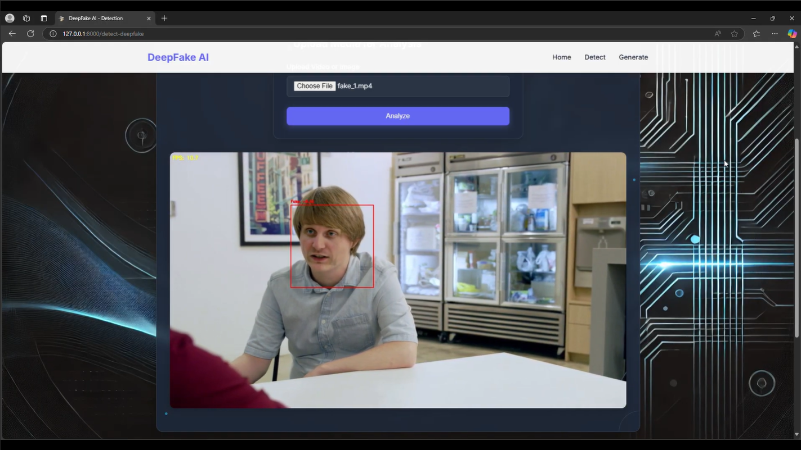

# DeepfakeStudio

## Overview
DeepfakeStudio is a web application built with Flask that offers both deepfake detection and generation capabilities. The project focuses primarily on research and implementation of various deepfake detection models, while also providing a face-swapping generation feature.

## Features

### 1. Home Page (`/`)
- Introduction to the DeepfakeStudio platform
- Overview of deepfake technology and its implications
- Navigation to detection and generation features

### 2. Deepfake Detection (`/detect-deepfake`)
Real-time deepfake detection through multiple input methods:
- YouTube video URL analysis
- Webcam feed detection
- Video file upload

Our detection system employs various neural network architectures researched and optimized by our team, including Shallow Networks, CNN, ResNet, and EfficientNet.

### 3. Deepfake Generation (`/gen-deepfake`)
Face-swapping capabilities:
- Upload a source image (face to be swapped)
- Upload a target video (where the face will appear)
- Generate a new video with the face from the source image seamlessly integrated

## Research

Our primary focus has been researching and implementing effective deepfake detection models. We've explored and compared multiple neural network architectures:

- **Shallow Neural Networks**: [Basic Implementation](https://www.kaggle.com/code/phnghunh2704/shallow-nn-deepfake-detection) | [Optimized Version](https://www.kaggle.com/code/phnghunh2704/shallow-nn-deepfake-detection-optimized)
- **Convolutional Neural Networks**: [Initial Model](https://www.kaggle.com/code/quynhfptct24/trung-nhan-wik4) | [Improved Model](https://www.kaggle.com/code/quynhfptct24/trung-nhan-w5)
- **ResNet Architecture**: [Implementation](https://www.kaggle.com/code/daofoah/resnet-daeepfake)
- **EfficientNet**: [Implementation](https://www.kaggle.com/code/daofoah/efficient-daeepfake)

For our dataset preparation methodology, see our [data processing notebook](https://www.kaggle.com/code/thameshuynh/train-val-test).

Full research findings are available in our [technical report](report.com).

## Demo

### Deepfake Detection
| Real Face Detection | Fake Face Detection |
|:-------------------:|:-------------------:|
|  |  |

### Deepfake Generation
| Source Image | Target Video | Face-Swapped Video |
|:-----------:|:-----------:|:------------------:|
|  |  |  |

## Technologies Used
- **Backend**: Flask
- **Deep Learning**: PyTorch, TorchVision, ONNX, ONNX Runtime
- **Computer Vision**: OpenCV, MediaPipe, InsightFace
- **Video Processing**: VidGear
- **Frontend**: HTML, CSS, JavaScript

## Models
The following pretrained models are utilized in this project:

### Detection Models: [Download](https://drive.google.com/file/d/11iiJCkNPaspD2vWK0ynEdFDwGmHMGfq0/view?usp=drive_link)

### Generation Models: [Download](https://drive.google.com/file/d/1nBhHZTfpDSwxfnqFbS_5pTA7_AJarIIQ/view?usp=drive_link)