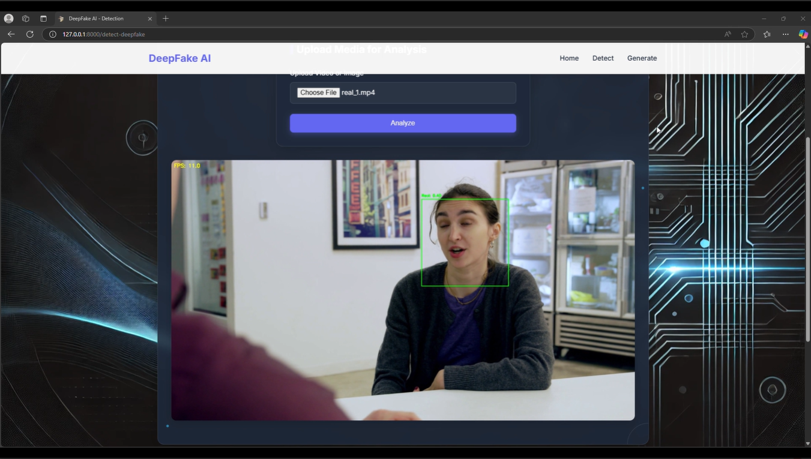
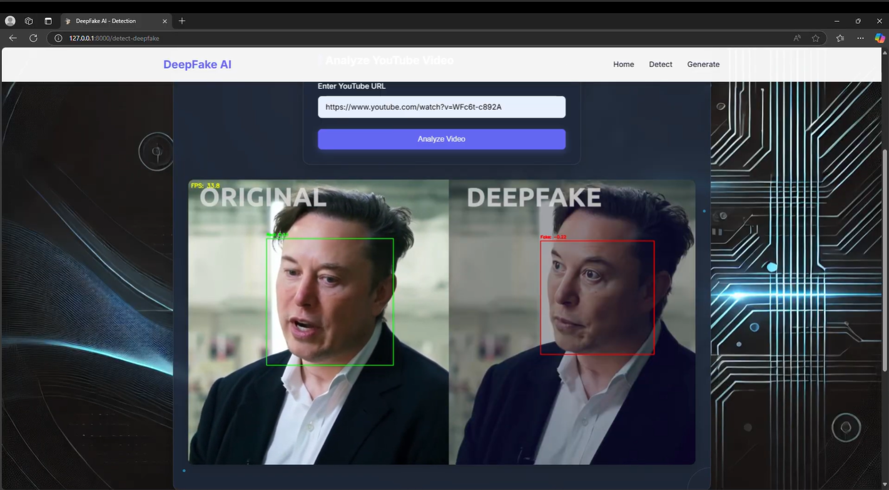

# 🌀 DeepfakeStudio  

## 🌟 Overview  
DeepfakeStudio is a web application built with Flask that offers both deepfake detection and generation capabilities. The project focuses primarily on research and implementation of various deepfake detection models, while also providing a face-swapping generation feature.  

## 🚀 Features  

### 🏠 1. Home Page (`/`)  
- 🎭 Introduction to the DeepfakeStudio platform  
- 📖 Overview of deepfake technology and its implications  
- 🔗 Navigation to detection and generation features  

### 🔍 2. Deepfake Detection (`/detect-deepfake`)  
Real-time deepfake detection through multiple input methods:  
- 📺 YouTube video URL analysis  
- 📷 Webcam feed detection  
- 🎞 Video file upload  

Our detection system employs various neural network architectures researched and optimized by our team, including **Shallow Networks, CNN, ResNet, and EfficientNet**.  

### 🎭 3. Deepfake Generation (`/gen-deepfake`)  
Face-swapping capabilities:  
- 📤 Upload a **source image** (face to be swapped)  
- 📤 Upload a **target video** (where the face will appear)  
- 🎬 Generate a **new video** with the swapped face seamlessly integrated  

## 📚 Research  

Our primary focus has been researching and implementing effective deepfake detection models. We've explored and compared multiple neural network architectures:  

- **🧠 Shallow Neural Networks**: [SGD Implementation](https://www.kaggle.com/code/phnghunh2704/last-shallow-sgd) | [AdamW Implementation](https://www.kaggle.com/code/phnghunh2704/last-shallow-adamw)  
- **🖼 Convolutional Neural Networks**: [Initial Model](https://www.kaggle.com/code/quynhfptct24/trung-nhan-wik4) | [Improved Model](https://www.kaggle.com/code/quynhfptct24/trung-nhan-w5)  
- **🎯 ResNet Architecture**: [Implementation](https://www.kaggle.com/code/daofoah/resnet-daeepfake)  
- **⚡ EfficientNet**: [Implementation](https://www.kaggle.com/code/daofoah/efficient-daeepfake)  

For our dataset preparation methodology, see our [📝 data processing notebook](https://www.kaggle.com/code/thameshuynh/train-val-test).  

📌 Full research findings are available in our [📄 technical report](https://www.overleaf.com/read/hbzsdfxvtydh#bf2f3d).  

## 🎥 Demo  

### 🔍 Deepfake Detection  
| ✅ Real Face Detection | ❌ Fake Face Detection | 🔄 All In One |  
|:-------------------:|:-------------------:|:----------------------:|  
|  |  |  |  

### 🎭 Deepfake Generation  
| 🖼 Source Image | 🎬 Target Video | 🔀 Face-Swapped Video |  
|:--------------:|:--------------:|:------------------:|  
|  |  |  |  

## 🛠 Technologies Used  
- **🖥 Backend**: Flask  
- **🧠 Deep Learning**: PyTorch, TorchVision, ONNX, ONNX Runtime  
- **👁 Computer Vision**: OpenCV, MediaPipe, InsightFace  
- **🎞 Video Processing**: VidGear  
- **🎨 Frontend**: HTML, CSS, JavaScript  

## 🤖 Models  
The following pretrained models are utilized in this project:  

### 🔍 Detection Models: [📥 Download](https://drive.google.com/file/d/11iiJCkNPaspD2vWK0ynEdFDwGmHMGfq0/view?usp=drive_link)  

### 🎭 Generation Models: [📥 Download](https://drive.google.com/file/d/1nBhHZTfpDSwxfnqFbS_5pTA7_AJarIIQ/view?usp=drive_link)  
